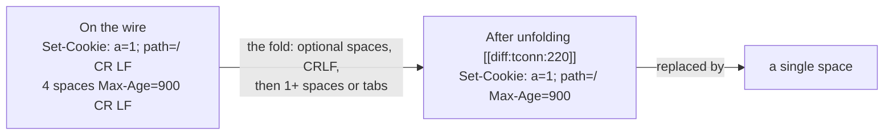

```mermaid
flowchart LR
    wire["On the wire<br>Set-Cookie: a=1; path=/ CR LF<br>4 spaces Max-Age=900 CR LF"]
    unfolded["After unfolding [[diff:tconn:220]]<br>Set-Cookie: a=1; path=/ Max-Age=900"]
    wire -->|"the fold: optional spaces, CRLF,<br>then 1+ spaces or tabs"| unfolded
    unfolded -->|"replaced by"| single["a single space"]
```

Caption: An obs-fold on the wire, and the value urllib3 now hands to callers. [[diff:tconn:214-222]]

```json
{
  "title": "Folded and unfolded header values"
}
```
