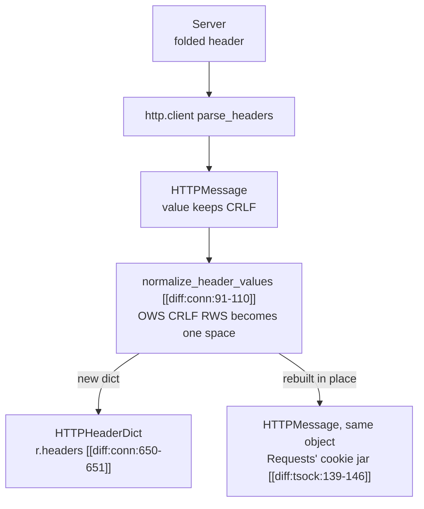

```mermaid
flowchart TB
    server["Server<br>folded header"]
    client["http.client parse_headers"]
    msg["HTTPMessage<br>value keeps CRLF"]
    norm["normalize_header_values [[diff:conn:91-110]]<br>OWS CRLF RWS becomes one space"]
    dict["HTTPHeaderDict<br>r.headers [[diff:conn:650-651]]"]
    same["HTTPMessage, same object<br>Requests' cookie jar [[diff:tsock:139-146]]"]
    server --> client --> msg --> norm
    norm -->|"new dict"| dict
    norm -->|"rebuilt in place"| same
```

Caption: Where a response's headers go after parsing, and the one place they are now unfolded.

```json
{
  "title": "Header data flow"
}
```
